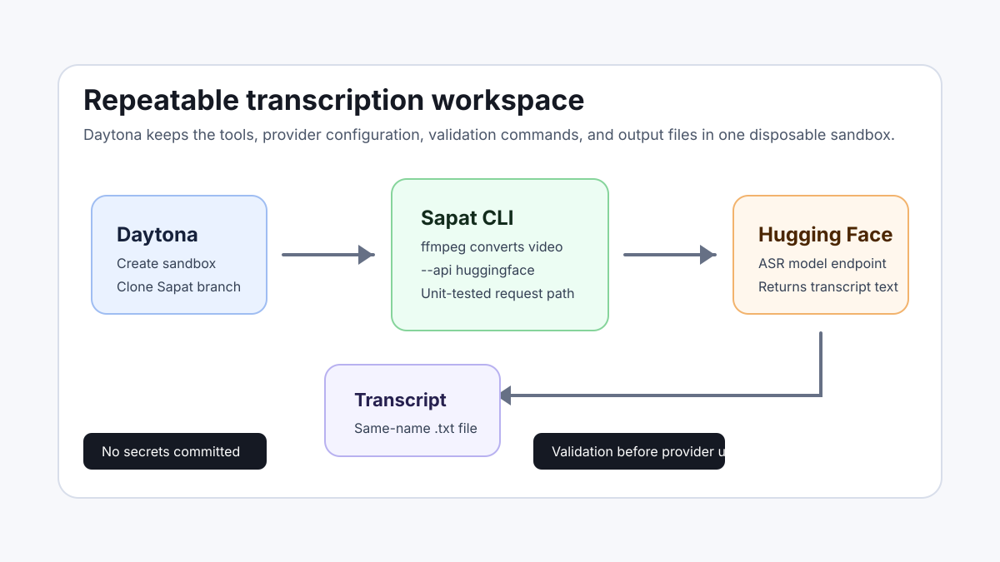

# Transcribe with Hugging Face in Daytona

# Introduction

AI transcription tools are most useful when the workflow is repeatable. A team
should be able to open a clean workspace, install the same dependencies, provide
provider credentials safely, run the same command against a recording, and
review the same output artifact. That is exactly where Daytona helps: it gives
you an isolated sandbox for the project instead of asking every developer to
rebuild the transcription environment on their laptop.

This guide shows how to run Sapat with a Hugging Face transcription provider
inside a Daytona sandbox. Sapat already handles the boring but important part of
the workflow: it converts input videos to MP3 with `ffmpeg`, sends the audio to
the selected transcription service, and writes the transcript beside the source
file. The companion Sapat pull request adds a small `huggingface` provider so
AI engineers can use a Hugging Face automatic speech recognition model through
the same CLI path as the existing OpenAI, Groq, and Azure providers.

The workflow is intentionally conservative. Secrets stay in `.env`, the
provider change is covered by mocked tests, and the guide uses a Daytona
sandbox so the setup is disposable. You can use the companion branch while the
provider pull request is under review, then switch to upstream `main` after it
is merged.

## TL;DR

- Create a Daytona sandbox and clone the Sapat branch that adds
  `--api huggingface`.
- Store the Hugging Face token in `.env`, never in Git.
- Install Sapat in a Python virtual environment and confirm the CLI exposes the
  new provider.
- Run a video file through Sapat and review the generated `.txt` transcript.
- Use targeted tests before changing provider code or model configuration.

## What You Will Build

The setup has four moving parts: Daytona, Sapat, `ffmpeg`, and the
[Hugging Face Inference API](/definitions/20260519_definition_hugging_face_inference_api.md).
Daytona provides the sandbox, Sapat owns the transcription command, `ffmpeg`
normalizes the input media, and Hugging Face runs the speech-to-text model.



The companion implementation lives in
[nibzard/sapat pull request #19](https://github.com/nibzard/sapat/pull/19).
It adds a `HuggingFaceTranscription` class, wires `huggingface` into Sapat's
`--api` option, documents the required environment variables, and adds unit
tests for request construction and error handling.

## Prerequisites

Before you start, make sure you have:

- The [Daytona CLI](https://www.daytona.io/docs/en/tools/cli/) installed and
  authenticated.
- A GitHub account that can clone public repositories.
- A Hugging Face access token with permission to call inference providers or
  your own dedicated Hugging Face endpoint.
- A short `.mp4`, `.mov`, or other video file you are allowed to transcribe.
- Basic comfort with Python virtual environments.

Do not paste production secrets into shell history shared with other users. For
team workflows, use your normal secret manager or Daytona environment handling
instead of committing a `.env` file.

## Step 1: Create a Daytona Sandbox

Create a small sandbox for the transcription work:

```bash
daytona create --name sapat-hf --class small
```

Open a shell inside the sandbox:

```bash
daytona ssh sapat-hf
```

Clone the companion Sapat branch. While the provider pull request is still
pending, use the fork and branch directly:

```bash
git clone https://github.com/manuelsampedro1/sapat.git
cd sapat
git checkout codex/huggingface-transcription-provider
```

After the provider is merged upstream, you can replace the clone URL with
`https://github.com/nibzard/sapat.git` and use the default branch instead.

## Step 2: Install System and Python Dependencies

Sapat uses `ffmpeg` to convert the source video to MP3 before sending audio to
the provider. Install it inside the sandbox:

```bash
sudo apt-get update
sudo apt-get install -y ffmpeg
```

Create and activate a Python virtual environment:

```bash
python3 -m venv .venv
. .venv/bin/activate
python -m pip install --upgrade pip setuptools wheel
python -m pip install -e .
```

Now confirm that the CLI sees the new provider:

```bash
python -m sapat.script --help
```

The `--api` option should include `huggingface` alongside `openai`, `groq`, and
`azure`. That check is cheap and catches the most common wiring mistake before
you spend any provider credits.

## Step 3: Configure Hugging Face Without Committing Secrets

Create a local `.env` file for the sandbox:

```bash
printf '%s\n' \
  'HUGGINGFACE_API_KEY=hf_your_token_here' \
  'HUGGINGFACE_MODEL=openai/whisper-large-v3-turbo' \
  'HUGGINGFACE_API_ENDPOINT=' \
  > .env
```

`HUGGINGFACE_API_KEY` is required. `HUGGINGFACE_MODEL` defaults to
`openai/whisper-large-v3-turbo` in the companion provider, but keeping it in
`.env` makes experiments explicit. `HUGGINGFACE_API_ENDPOINT` is optional and
is useful when you run a dedicated Inference Endpoint rather than a model route
on the shared API.

The provider sends raw audio bytes to Hugging Face and expects either a JSON
response with a `text` field or plain text. This follows the automatic speech
recognition API shape documented by Hugging Face, where raw audio payloads are
accepted when no additional parameters are required.

## Step 4: Validate the Provider Before Using a Real Recording

Run the unit tests added with the provider:

```bash
python -m unittest discover -s tests
```

The tests mock the outbound request, so they do not call Hugging Face and do
not require a real token. They verify that Sapat:

- Requires `HUGGINGFACE_API_KEY` before making a request.
- Builds the model endpoint from `HUGGINGFACE_MODEL`.
- Respects `HUGGINGFACE_API_ENDPOINT` when you provide a dedicated endpoint.
- Sends the correct audio `Content-Type` for supported file extensions.

You should also run:

```bash
git diff --check
```

That catches whitespace issues before you turn the sandbox into a repeatable
workflow for teammates.

## Step 5: Transcribe a Sample Video

Create a folder for local media and copy a short test video into it:

```bash
mkdir -p media
```

Upload or copy your allowed sample video to `media/demo.mp4`. Then run Sapat
with the Hugging Face provider:

```bash
sapat media/demo.mp4 --api huggingface --quality M --language en --temperature 0.0
```

Sapat converts `media/demo.mp4` to `media/demo.mp3`, sends the MP3 file to
Hugging Face, writes the transcript to `media/demo.txt`, and removes the
temporary MP3 file when it finishes.

Open the transcript:

```bash
sed -n '1,120p' media/demo.txt
```

For longer recordings, start with one short clip before running a whole
directory. That keeps provider costs predictable and gives you a quick signal
on model quality.

## Step 6: Batch a Small Folder Safely

Sapat also accepts a directory and processes each `.mp4` file inside it:

```bash
sapat media --api huggingface --quality M --language en --temperature 0.0
```

Use this only after the single-file test succeeds. A simple folder structure
keeps the output easy to review:

```text
media/
  demo-001.mp4
  demo-001.txt
  demo-002.mp4
  demo-002.txt
```

If you are processing meeting or demo recordings, keep a small manifest in the
workspace:

```markdown
| File | Source | Permission | Expected Language | Notes |
| --- | --- | --- | --- | --- |
| demo-001.mp4 | Product demo | Internal recording | English | Speaker names matter |
```

The manifest is not required by Sapat, but it helps reviewers understand where
each transcript came from and whether it can be shared.

## Step 7: Know the Current Limits

The Hugging Face provider in the companion PR is deliberately small. It focuses
on transcription, endpoint configuration, content type handling, and transcript
parsing. It does not implement Sapat's optional `--correct` pass. In the
current Sapat base class, `--correct` calls a separate correction method, and
providers must implement that method themselves.

For now, run the Hugging Face command without `--correct`. If you need a
post-processing pass, keep that as a separate step so the transcription
provider remains easy to test:

```bash
cp media/demo.txt media/demo.review.txt
```

Then use your normal review tool or LLM workflow to clean punctuation, speaker
names, and product names. Keeping the correction step separate also makes it
easier to compare raw transcript quality across models.

## Troubleshooting

**Problem:** `--api huggingface` is not listed in `python -m sapat.script --help`.

**Solution:** Check that you are on the companion branch:

```bash
git branch --show-current
```

If it is not `codex/huggingface-transcription-provider`, switch branches and
reinstall the package in editable mode:

```bash
git checkout codex/huggingface-transcription-provider
python -m pip install -e .
```

**Problem:** Sapat raises `HUGGINGFACE_API_KEY must be set`.

**Solution:** Confirm `.env` exists in the repository root and contains a real
token. If you prefer shell exports, set the variable before running Sapat:

```bash
export HUGGINGFACE_API_KEY=hf_your_token_here
```

**Problem:** Hugging Face returns a provider or model error.

**Solution:** Confirm that the model supports automatic speech recognition for
your account and provider. If you use a dedicated endpoint, set
`HUGGINGFACE_API_ENDPOINT` to that endpoint URL and keep `HUGGINGFACE_MODEL` as
documentation for the selected model.

**Problem:** `ffmpeg` fails before the provider call.

**Solution:** Run `ffmpeg -version` inside the Daytona sandbox. If it is
missing, install it with `sudo apt-get install -y ffmpeg`. If the file is
corrupt or unsupported, try a short known-good MP4 first.

**Problem:** The transcript is empty or lower quality than expected.

**Solution:** Test a shorter clip with clearer audio, set `--quality H`, and
compare another ASR-capable Hugging Face model. Keep the first run small so you
can separate model quality from setup mistakes.

## Production Notes for AI Engineers

For a team workflow, do not treat this as a one-off command. Treat it as a
repeatable development environment:

- Keep provider credentials in the sandbox environment or a secret manager.
- Keep provider code, tests, and README examples in Git.
- Run the mocked tests before changing request behavior.
- Start every new model with a short smoke clip.
- Save raw transcripts separately from edited transcripts.
- Record which model and endpoint produced each transcript.

That last point matters. Transcription quality can change when you switch
models, providers, endpoints, or audio quality settings. A small note in your
manifest is usually enough:

```markdown
Model: openai/whisper-large-v3-turbo
Provider path: Hugging Face Inference API
Sapat branch: codex/huggingface-transcription-provider
Quality: M
Language hint: en
```

## Conclusion

You now have a Daytona sandbox that can run Sapat with a Hugging Face-backed
transcription provider. The important part is not just the provider option; it
is the repeatable workflow around it. The sandbox contains the same source
branch, the same dependency setup, the same validation commands, and the same
artifact layout every time you run it.

Once the companion provider PR is merged, the same guide works from upstream
Sapat with fewer branch-specific steps. Until then, the forked branch gives you
a concrete, reviewable implementation that can be tested without exposing
secrets or calling external services during unit tests.

## References

- [Companion Sapat provider pull request](https://github.com/nibzard/sapat/pull/19)
- [Hugging Face automatic speech recognition API documentation](https://huggingface.co/docs/api-inference/en/tasks/automatic-speech-recognition)
- [Hugging Face HF Inference provider documentation](https://huggingface.co/docs/inference-providers/en/providers/hf-inference)
- [Daytona CLI documentation](https://www.daytona.io/docs/en/tools/cli/)
